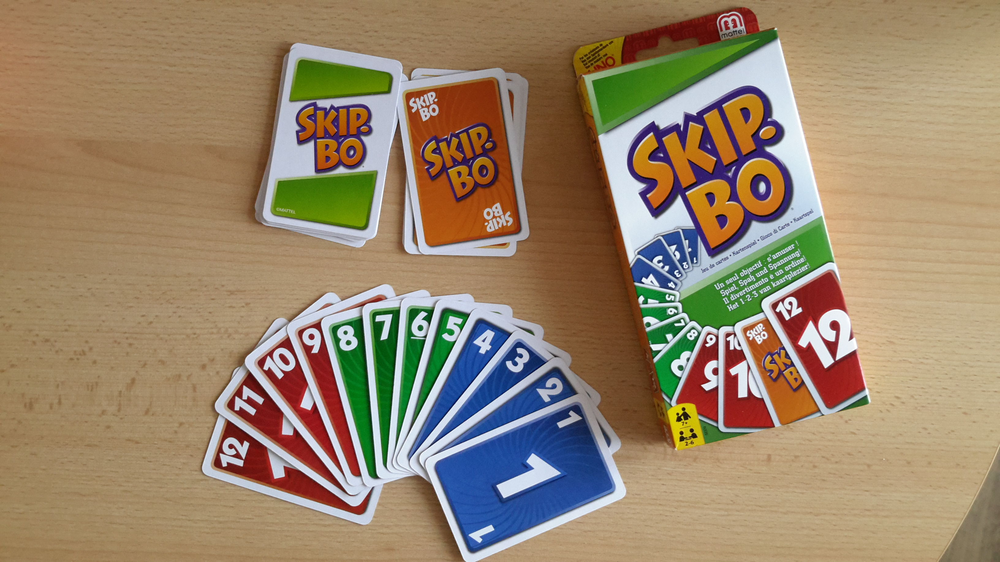
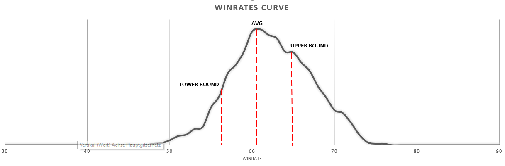

# Rust Skipbo

### Rules



The rules can be read at [https://en.wikipedia.org/wiki/Skip-Bo](https://en.wikipedia.org/wiki/Skip-Bo).
My implementation of the game assumes 12 different cards and 1 joker.

### Implementation

Each round, a `Player` object is passed to the `play()` method invoked on the `Game` object. Inside the `play` function the gamestate is handed over to the `play()` method of the `Player` object. The `Player` then plays as many cards as he wants and then puts one of his cards onto the "side"-stack.

To make a move (play a card) the `Player` passes a `Move` struct which contains the `to`-stack  and `from`-stack to the `execute_move()` method on the `Game` object. To choose a move, the `Player` calls the `get_valid_moves()` method which returns a `Vec` of moves.

If you want your player to follow a specific strategy, you can create implement your own `Player` object and change how he selects the move and the card to set aside.

### Getting Started

Run: `cargo run` and watch as the games are played. It will print something similar to this:

This will play a certain amount of rounds. For each round, a certain amount of games will be played. The winrate is defined as the average wins per round.

```markdown
Games played: 200000

PlayerNum: 0
Avg: 38.67  *<- average winrate (average of average games won per round)*
Range: 31 *<- difference between highest winrate and lowest winrate*
Lowest: 25 *<- Lowest winrate*  |  Lower Avg: 34.56 *<- Similar to the lower bound of the confidence interval*
Highest: 56 *<- Highest winrate*  |  Higher Avg: 41.81 *<- Similar to the upper bound of the confidence interval*


PlayerNum: 1 
Avg: 61.33 
Range: 31 
Lowest: 44  |  Lower Avg: 57.64 
Highest: 75 |  Higher Avg: 64.80

Seconds elapsed: 990
```



You could then use this data to find out how your player is performing. With this data we can see that the second player is slightly better than the first one.  
Thanks to the `Range`, which at 31 is very high, we can also see that this is highly fluctuating and that there can be games where the second player performs badly and ones where it performs very well. But the confidence interval seems to be rather small at only 7 points. This would indicate that outlier games (extremely good or bad performance) are not that often.

If the range was only at 7 for example we would know that our algorithm is very stable and does not depend too much on the cards. If the confidence interval was large however, for example 20 points, we would know that our algorithm is very variable.

### Modifying the game

To change things up you could change or add players in this line:
```rust
// Change this to the number of players you have
fn get_stats() -> (i64, Vec<(i64, f64, i64, i64, f64, i64, f64)>) {
    // Change this to the number of players
    let player_num: i64 = 2;
    let mut winrates: Vec<Vec<i64>> = vec![Vec::new(); player_num as usize];
    let games: i64 = 100;
    let rounds: i64 = 100;

...

for _ in 0..rounds_to_play {
        // Change the amount of cards each players starts with or add a new PlayerState
        let mut game = SkipBoGame::new(vec![PlayerState::new(20), PlayerState::new(20)]);

        // !!!! If you add a new PlayerState, remember to add another Player as well: SimplePlayer GoodPlayer, BadPlayer
        let (w, i) = play_game(&mut game, vec![Box::new(SimplePlayer {}), Box::new(GoodPlayer {})]);
        
        wins[w as usize] += 1;
        rounds += i;
}
```

### Implementing a new Player

To implement a new player, add a file to the `src/players/` directory with the name of your player as the filename.

```rust
// ./src/players/your_player.rs
use crate::{player::Player, move_stack::{Move, CardStack}};

pub struct YourPlayer {}
impl Player for YourPlayer {
    fn select_move(&self, moves: Vec<Move>, _stack: i8, _opponent_stack: i8, _side: [Vec<i8>; 4], _hand: Vec<i8>, _playing_field: [(i8, bool); 4]) -> Option<Move> {
        ...
    }

    fn select_stack(&self, _hand: Vec<i8>, side: [std::vec::Vec<i8>; 4]) -> Move {
        ...
    }
}
```

Then add your player to `src/players/mod.rs`:

```rust
pub mod good_player;
pub mod simple_player;
pub mod player;
        pub mod your_player; <- Add this
```

And import it in main.rs:

```rust
use crate::players::{
        your_player::YourPlayer, <- Add your player
        good_player::GoodPlayer, player::NewPlayerState, simple_player::SimplePlayer, player::{Player, PlayerState}};
```